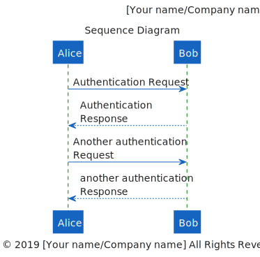
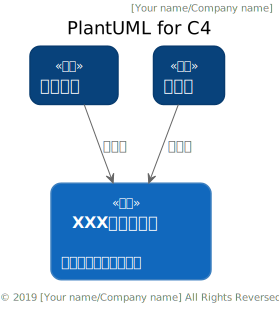

# PlantUML style

## Introduction
This project based on [C4-PlantUML](https://github.com/RicardoNiepel/C4-PlantUML) and [plant-style-c4](https://github.com/xuanye/plantuml-style-c4).  
I just aggregated these two projects and added some Chinese support and origin switching.

## Usage
Please see starter template.

## Showcase

## Local version
Please see local branch.