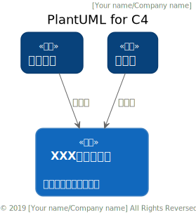

# PlantUML style

## 介绍
这个项目基于[C4-PlantUML](https://github.com/RicardoNiepel/C4-PlantUML)和[plant-style-c4](https://github.com/xuanye/plantuml-style-c4)。  
我只是聚合了这两个项目，并添加了部分中文支持和源切换。

## 用法
请看Starter template。

## 展示

## 本地版
请使用local分支。